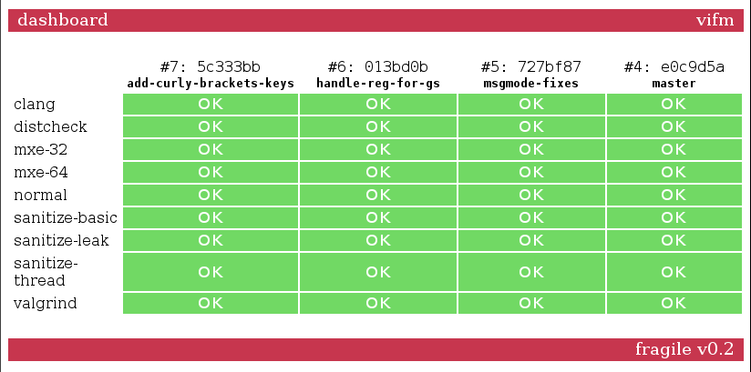

_fragile_
_2015 - 2016_

**Last updated**: 28 January, 2016
**Version**: 0.4

### Brief Description ###

This is a simple, minimal and straightforward CI to compensate complexity of
many CIs out there among which the author of this one couldn't pick (although he
tried really hard to omit creating one more).

### Dependencies ###

* PHP
* SQLite
* Unix-like system with bash
* Git (by default, but can be changed by editing `vcs/*`)

### Screenshot ###

### Demo ###

One can see it being used [here](http://ci.vifm.info/).

### License ###

GNU Affero General Public License, version 3 or later.
