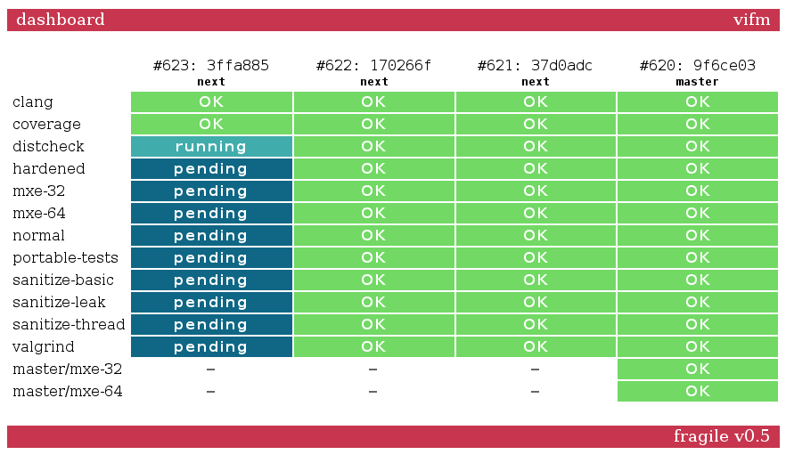

**fragile**, _v0.5_, _2015 – 2017_

_This file last updated on 17 July, 2017_

### Brief Description ###

This is a simple, minimal and straightforward CI to compensate complexity of
many CIs out there among which author of this one couldn't pick, even though he
tried really hard to omit creating one more CI.  It's worth nothing that end
result turned out to be somewhat more complicated than planned, which might be
fixed in the future.

### Dependencies ###

* PHP
* SQLite
* Unix-like system with bash
* Git (by default, but can be changed by editing `vcs/*`)

### Small Features (because there are no big ones) ###

* No "hard to get working" dependencies
* No special configuration interface (adding a builder is just adding a script
  to a directory)
* No parallel execution
* No external builders
* Automatic errors/warnings discovery and highlighting
* Just HTML, no useless animations or anything like that
* Simple SVG badges (`badges/svg/<branch-name>`)

### Screenshot ###

### Demo ###

One can see it being used [here](http://ci.vifm.info/).

### License ###

GNU Affero General Public License, version 3 or later.
